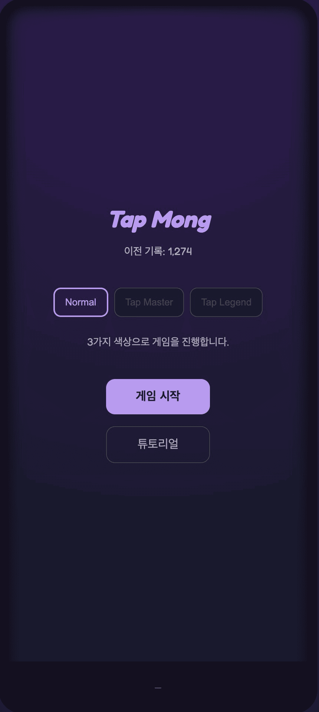
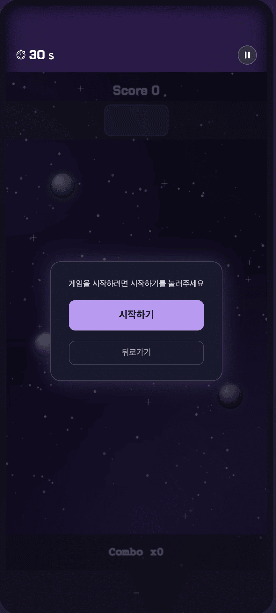
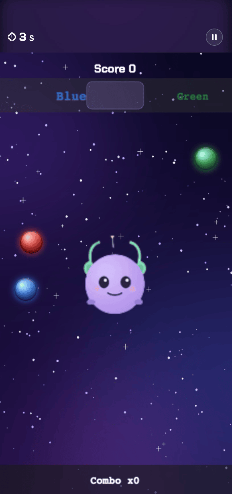
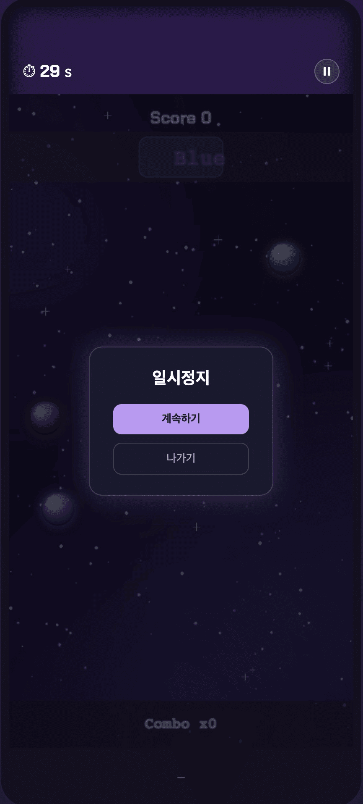
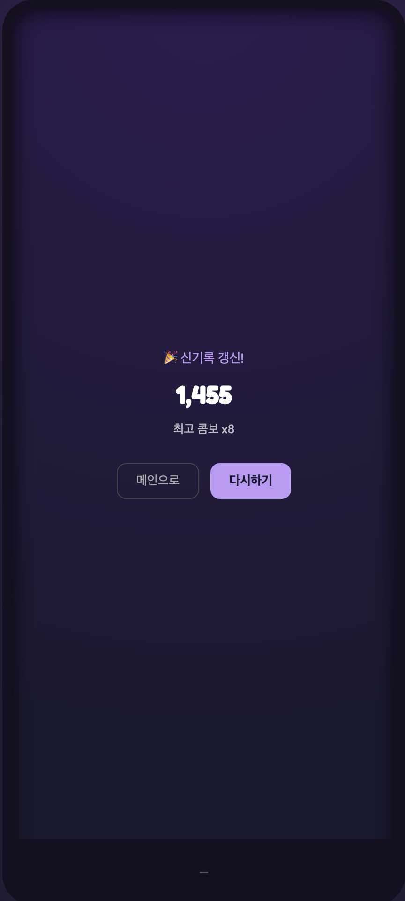
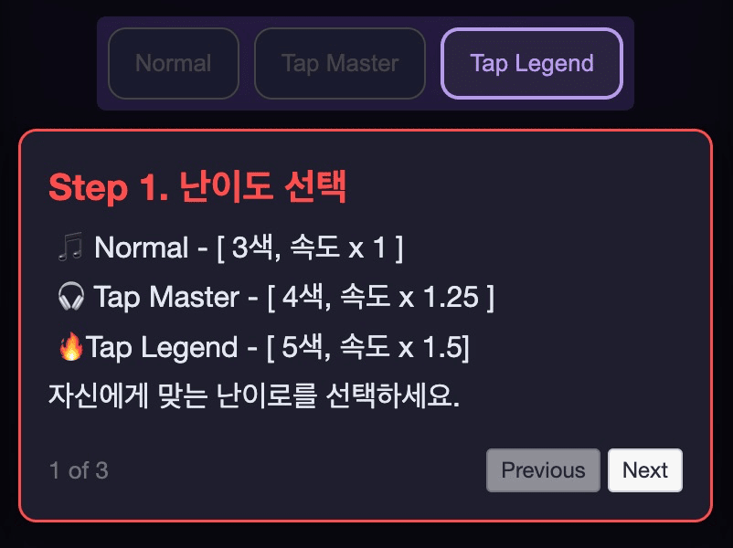
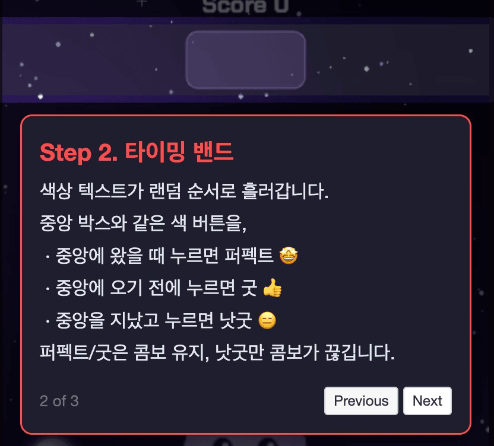
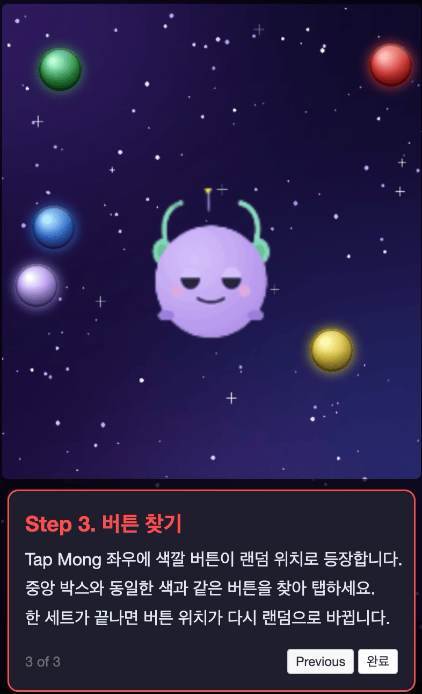

# Tap Mong

Tap Mong 좌우 랜덤 위치에 등장하는 색상 버튼을, 상단 타이밍 밴드에 맞춰 정확히 눌러 점수를 얻는 웹 아케이드 게임.

**플레이하기 →** https://tap-mong.vercel.app

## 스택

- React + TypeScript + Vite
- Phaser.js (Arcade Physics)
- driver.js (튜토리얼)
- 타겟: 모바일 세로형 (9:16, max-width 480px). 데스크톱 브라우저에서도 동일 프레임으로 표시됨

## 로컬 실행

```bash
npm install
npm run dev
```

## Vercel 배포

1. vercel과 github main 브랜치 연동
2. main 브랜치 push할 때마다 자동 빌드/배포
3. https://tap-mong.vercel.app

## 조작 설명서

#### 메인화면



화면: 메인화면
설명: 중간에 난이도 선택, 하단에 게임시작 버튼, 튜토리얼 버튼으로 구성

- 중간에 있는 난이도 선택 버튼을 클릭해서 자신에게 맞는 난이도를 선택
  - Normal: 3가지 색(빨강, 파랑, 초록), 속도 x 1
  - Tap Master: 4가지 색(빨강, 파랑, 초록, 노랑), 속도 x 1.25
  - Tap Legend: 5가지 색(빨강, 파랑, 초록, 노랑, 보라), 속도 x 1.5

#### 게임화면



화면: 게임 시작 화면
설명: 게임 진입했을 때 나오는 모달

- 시작하기: 게임을 시작
  - 30초 시간 카운트 시작
- 뒤로가기: 메인화면으로 이동



화면: 게임 화면
설명: 선택한 난이도의 색상 버튼이 Tap Mong 좌우 랜덤 위치에 나타난다.

- 점수 룰
  - 상단 중앙 밴드에 글자의 90%이상 들어오면 Perfect 점수 획득
  - 상단 중앙 밴드에 글자의 40~90% 들어오면 Good 점수 획득
  - 상단 중앙 밴드에 글자의 10~40% 들어오면 Not Good 점수 획득
  - 상단 중앙 밴드에 글자의 10% 미만이면 Bad
  - 글자색과 다른색의 버튼을 탭하면 Bad
- 콤보 룰
  - Perfect / Good 은 콤보 유지
  - Not Good / Bad 는 콤보 리셋



화면: 일시정지 화면
설명: 일시정지 버튼을 눌렀을 때 나오는 모달

- 계속하기: 게임을 계속 이어간다
- 나가기: 게임을 종료하고 메인화면으로 이동

#### 결과화면



화면: 결과화면
설명: 획득한 점수와 콤보 기록이 나오는 화면

- 이전 기록보다 더 좋은 기록이면 “신기록 갱신” 나타남
- 메인으로: 메인화면으로 이동
- 다시하기: 선택했던 난이도로 다시 게임

#### 튜토리얼 화면



화면: 튜토리얼 step 1
설명: 난이도 선택을 설명하는 튜토리얼 화면

- Next 버튼을 누르면 다음 튜토리얼로 이동



화면: 튜토리얼 step2
설명: 게임 플레이를 설명하는 튜토리얼 화면

- 글자가 지나가는 밴드에 대한 설명
- previous 버튼을 누르면 이전 튜토리얼로 이동
- Next 버튼을 누르면 다음 튜토리얼로 이동



화면: 튜토리얼 step3
설명: 게임 플레이를 설명하는 튜토리얼 화면

- 글자와 동일한 색상의 버튼을 탭에 대한 설명
- previous 버튼을 누르면 이전 튜토리얼로 이동
- Next 버튼을 누르면 다음 튜토리얼로 이동

#### 종료조건

1. 30초가 지나면 게임 종료
2. 일시정지 버튼 클릭 후 나가기 버튼 클릭시 게임 종료
